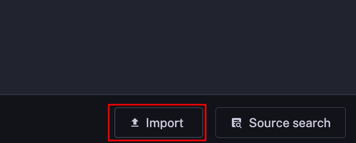
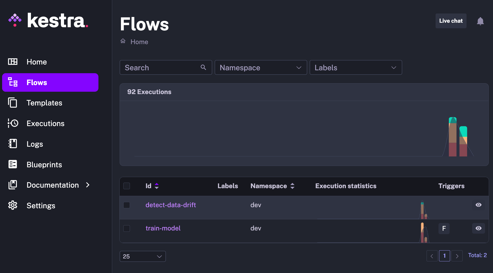

# Detect Data Drift

## Motivation
Data drift occurs when the distribution of input features in the production environment differs from the training data, leading to potential inaccuracies and decreased model performance.

To mitigate the impact of data drift on model performance, this workflow automates the process of detecting drift, notifying the data team, and triggering model retraining.

## Try it out

Clone the repo:

```bash
git clone https://github.com/khuyentran1401/detect-data-drift-pipeline
```

Next, create and start a Docker container running a PostgreSQL server with prepopulated tables:

```bash
docker run -d -p 5432:5432 -e POSTGRES_PASSWORD=... -e POSTGRES_USER=... khuyentran1401/bikeride-postgres:latest
```

Before running the application, add the required environment variables to the ".env" file:

```bash
POSTGRES_USERNAME=...
POSTGRES_PASSWORD=...
SLACK_WEBHOOK=...
AWS_ACCESS_KEY_ID=...
AWS_SECRET_ACCESS_KEY_ID=...
```

Encode these environment variables and save them in the ".env_encoded" file by running:

```bash
bash encode_env.sh
```

Now, start the containers for Kestra:

```bash
docker compose up -d
```

You can access Kestra's user interface at http://localhost:8080.

To import example flows into Kestra, click the "Import" button and select the files located in the "kestra_pipeline" directory



After importing, you will see the following flows:

